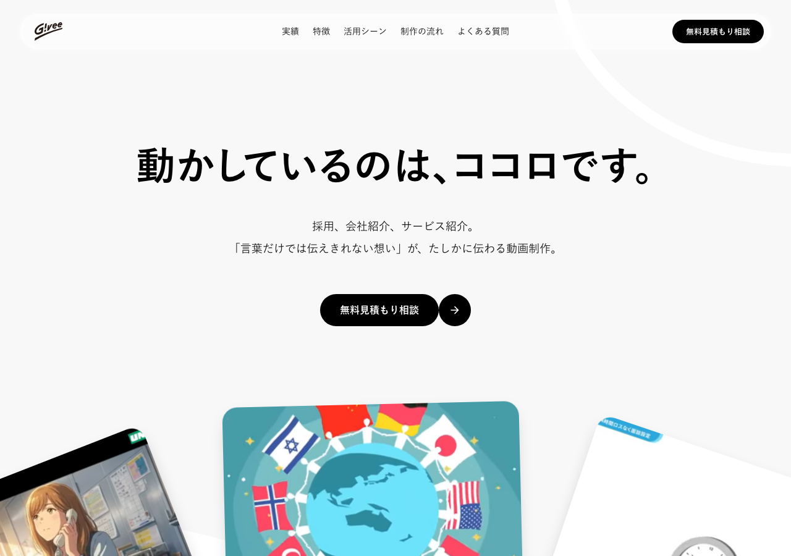
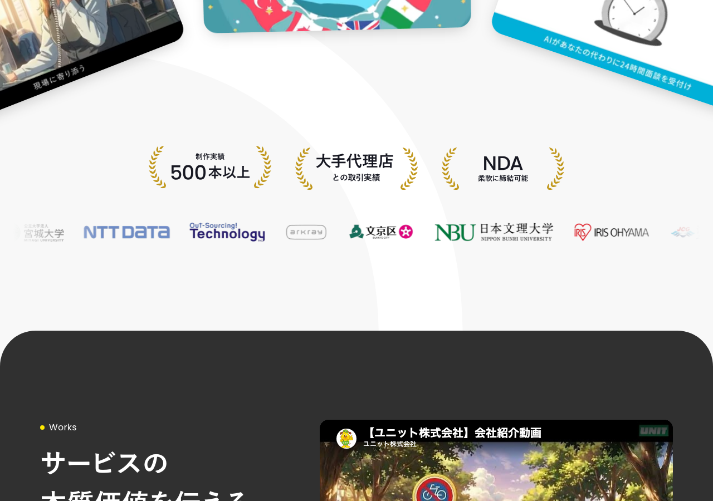
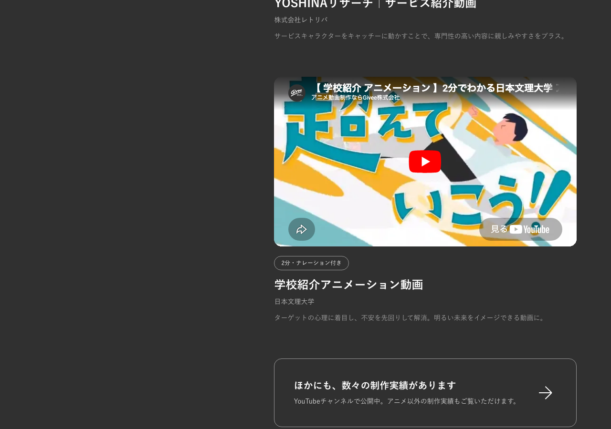
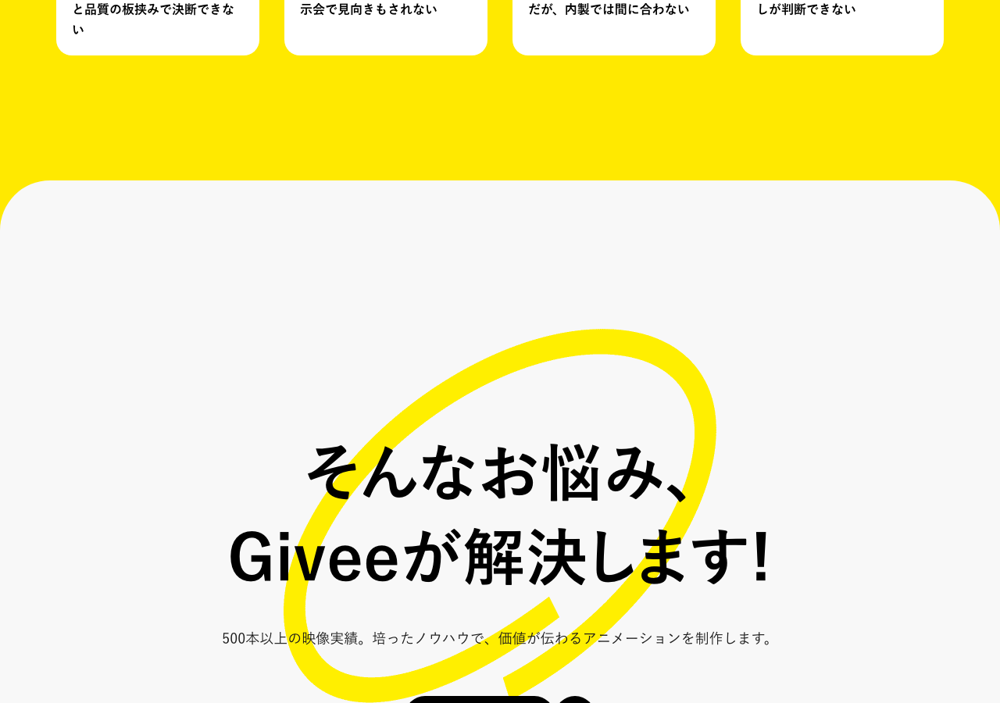

# Givee（アニメーション動画制作） - デザイン分析

**URL:** https://animation.givee.co.jp/  
**分析日:** 2026-06-27

## スクリーンショット

## サービス・コンテンツ概要
BtoB向けアニメーション動画制作サービス。採用動画・会社紹介・サービス紹介を、映像制作のプロがAIと人の手を組み合わせてハイブリッド制作。制作実績500本以上。実写動画（100万円〜）やセルアニメ外注（300万円〜）より低コストで、高品質な動画を短納期で提供。

## ターゲットユーザー
- 中小〜大手企業のマーケ・広報・人事担当者
- 動画制作のコストと品質の板挟みになっている企業
- 展示会・採用・サービス紹介で動画活用を検討しているが一歩踏み出せない企業

## カラーパレット（CSS実測値）
| 用途 | 色 |
|------|-----|
| 背景（メイン） | rgb(248, 248, 248) → #F8F8F8 |
| メインテキスト | rgb(17, 17, 17) → #111111 |
| ダークセクション背景 | rgb(48, 48, 48) → #303030 |
| アクセント（イエロー） | rgb(255, 233, 0) → #FFE900 |
| CTA背景 | #111111（黒） |
| CTA文字 | #FFFFFF（白） |
| フッター背景 | rgb(255, 233, 0) → #FFE900 |

## タイポグラフィ
- **見出しフォント:** 游ゴシック体 / Yu Gothic / YuGothic / ヒラギノ角ゴ ProN / Hiragino Kaku Gothic ProN / sans-serif
- **H1サイズ:** 64px / ウェイト700（Bold）
- **本文フォント:** 同上（游ゴシック体ファミリー）
- **特徴:** 英字はシステムフォントのまま。游ゴシックを基盤に日本語環境での表示品質を最優先。ゴシック体の読みやすさと太字の力強さを両立。

## セクション構成（上から順）
1. **ナビゲーション（sticky）:** ロゴ左、メニュー中央（実績・特徴・活用シーン・制作の流れ・よくある質問）、右端にCTAボタン「無料見積もり相談」
2. **ヒーロー（ライトグレー背景）:** 大きなキャッチコピー中央配置、サブコピー、CTAボタン、横スクロールするアニメ動画サムネイル3点
3. **信頼性バー:** 「制作実績500本以上」「大手代理店との取引実績」「NDA柔軟に締結可能」3列
4. **クライアントロゴ一覧（横スクロールアニメ）:** 日本文理大学・IRIS OHYAMA・海上保安庁・空研工業・LIXILなど
5. **Works（実績紹介）（ダーク#303030背景）:** 「サービスの本質価値を伝える。」+ 実績動画YouTube埋め込み
6. **課題提起（黄色背景）:** 「動画を作りたい、でも一歩踏み出せない。」企業の悩み4パターン
7. **解決提案（ライトグレー背景）:** 「Giveeが解決します！」500本以上の実績を背景に訴求、再CTA
8. **Before/After比較（ダーク背景）:** 実写動画・セルアニメ外注・量産型AI動画の課題（モノクロ写真）vs Giveeアニメ（黄色カード）
9. **Feature（特徴）（ダーク背景+アニメキャラ）:** 「高品質×低コストを諦めない。」等の特徴訴求
10. **活用シーン一覧:** 採用・展示会・サービス紹介など
11. **制作の流れ:** ステップ解説
12. **よくある質問:** アコーディオン
13. **お問い合わせフォーム（黄色背景）:** 6ステップのウィザード型診断フォーム
14. **フッター（黄色背景）:** ロゴ・住所（港区愛宕）・電話番号

## ヒーローセクション詳細
- **レイアウト:** テキスト中央配置（横幅いっぱい）、下にビジュアル（横スクロールするアニメ動画カード3点）
- **キャッチコピー:** 「動かしているのは、ココロです。」— 「動かす」の多義性（映像が動く/感情を動かす）を活用したダブルミーニング
- **サブコピー:** 「採用、会社紹介、サービス紹介。『言葉だけでは伝えきれない想い』が、たしかに伝わる動画制作。」
- **ビジュアル要素:** 3枚のアニメーション動画サムネイルがカード型横並び（タブレット画面モックアップ風）
- **CTA:** ピル型黒ボタン「無料見積もり相談」+ 矢印円形ボタンのセット。ヒーロー中央に1セット
- **背景:** #F8F8F8（ライトグレー）に白い波形装飾（SVG）

## CTAデザイン
- **形状:** ピル型（完全な丸角）
- **色:** 背景#111111（黒）/ 文字#FFFFFF（白）
- **サイズ感:** 大きめ・存在感あり
- **パターン:** プライマリCTAは単一「無料見積もり相談」のみ（セカンダリなし）
- **配置:** ヘッダー右端（固定sticky）+ ヒーロー内 + 課題解決セクション末尾

## ナビゲーション
- **スタイル:** Sticky固定。スクロール後は白カード風（角丸・影あり）に変化
- **ロゴ:** 左端。「G!vee」手書き風ロゴタイプ（太字）
- **メニュー項目:** 5項目（実績・特徴・活用シーン・制作の流れ・よくある質問）
- **ナビCTA:** あり。右端に黒ピル型「無料見積もり相談」ボタン

## アイコン・イラスト・ビジュアルスタイル
- **制作実績サムネイル:** 実際のアニメ動画（AI風・セルアニメ風・モーショングラフィックス風など多様）
- **ロゴウォール:** クライアントブランドロゴ（グレースケールで統一感）
- **Before/After:** ビフォーはモノクロ（実写撮影機材写真）、アフターは黄色背景＋カラーアニメ。鮮烈なコントラスト
- **Featureセクション:** 夜景・ボケ光・アニメキャラのシネマティックな背景

## トンマナ・世界観
- **雰囲気キーワード:** スタイリッシュ、力強い、ミニマル、クリエイティブ、信頼感
- **コピートーン:** エモーション重視（「ココロ」「想い」「伝わる」）＋課題解決型。やや詩的でブランドらしさがある
- **特徴的な表現:**
  - 「動かしているのは、ココロです。」（ダブルミーニング）
  - 「高品質×低コストを諦めない。」（対立軸の解消宣言）
  - 「そんなお悩み、Giveeが解決します！」（課題→解決の王道構成）

## 特徴的なデザイン要素・テクニック
- **黒×黄色の強烈なコントラスト:** #111111と#FFE900。フッター・フォームが黄色で締まりサービスのエネルギー感を演出
- **Before/Afterセクション:** ダーク背景の「Before（実写・セルアニメ）」とYellow「After（Giveeアニメ）」カード並置。競合との差分を視覚で即理解させる
- **アワードローレル装飾:** 「500本以上」などの数字に月桂冠アイコンを付けて実績を権威化
- **ウィザード型問い合わせフォーム:** 動画内容・長さ・テイスト・ナレーション・素材・納期を先に聞き、最終ステップで連絡先入力。リード獲得ハードルを段階的に下げる設計
- **横スクロール動画カルーセル:** ヒーロー下の実績サムネイルが左右にはみ出して見え、「続きがある」視線誘導を自然に行う

## Lapsellへの応用メモ
このサイトの要素をLapsell（地下アイドル向け練習時間収益化）LPに応用する場合:
- **Before/After構造の転用:** 「練習動画がSNSに使えるクオリティじゃない」「録画機材がない」→「Lapsellなら3レイヤー自動録画・自動配信」という課題→解決の並置構造が直接転用可能
- **ウィザード型フォームの導入:** 「活動ジャンル（ダンス/歌/演奏）」→「ファン数・活動規模」→「出品したい練習スタイル」の順に聞き、いきなり連絡先を聞かない設計でアーティスト登録CVを向上させられる
- **黄色×黒のアクセントカラー:** 地下アイドルのライブ感・エネルギー感を表現する配色として参考になる。ただしLapsellのトーン（ミュージシャン向けクリエイティブな信頼感）に合わせた調整が必要
