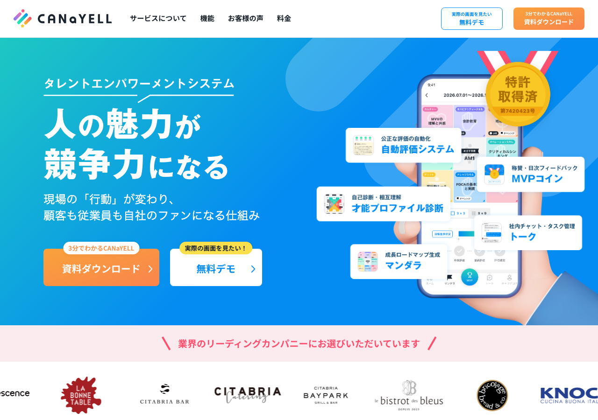
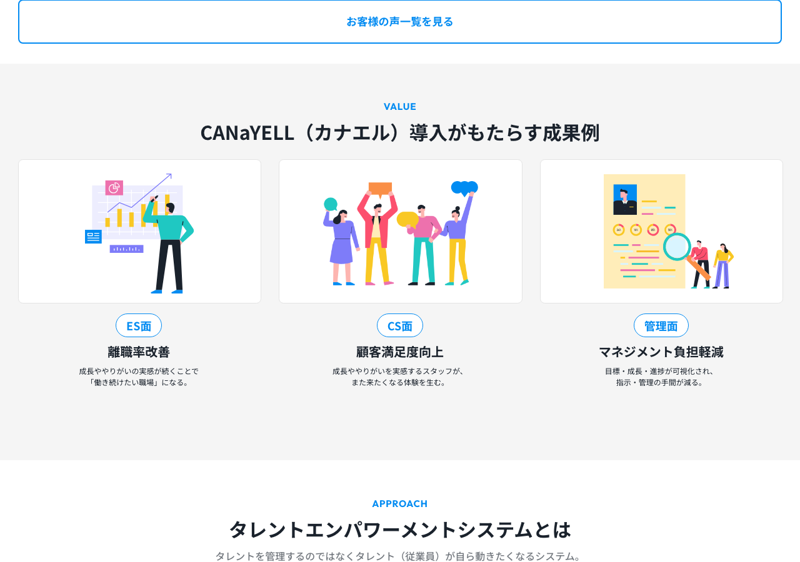
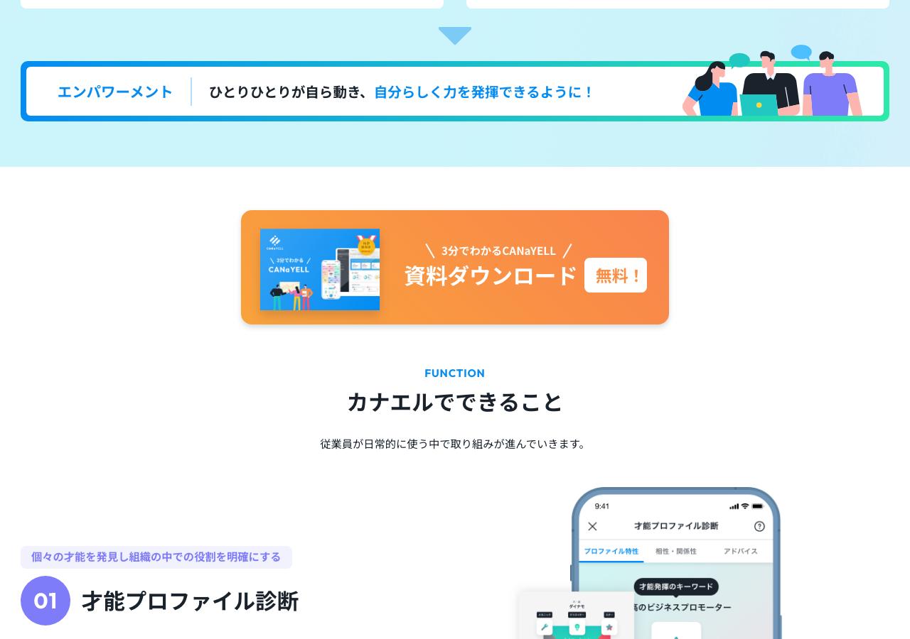
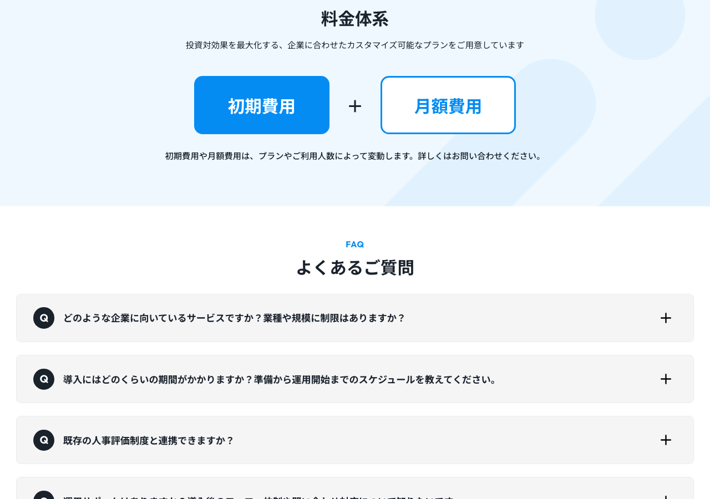

# CANaYELL（カナエル） - デザイン分析

**URL:** https://www.can-a-yell.jp/  
**分析日:** 2026-06-27

## スクリーンショット

## サービス・コンテンツ概要
飲食業・サービス業向けタレントエンパワーメントシステム（SaaS）。スタッフ（タレント）の才能・魅力を引き出し、従業員エンゲージメントと顧客満足度（CS）を同時に高める仕組みを提供。主な機能：自動評価システム・MVPコイン（稱賛・日次フィードバック）・才能プロファイル診断・社内チャット＆タスク管理・マンダラ（成長ロードマップ生成）。特許取得済（第7420423号）。運営会社：thanXi Inc.

## ターゲットユーザー
- 飲食業・サービス業（BtoB SaaS）
- 人材定着・離職率改善に課題を抱える中小企業の経営者・HR担当者
- 「管理するのではなく、スタッフが自ら動くようにしたい」と考えるオーナー・マネージャー
- 顧客満足度の向上と従業員エンゲージメント向上を同時に実現したい企業

## カラーパレット（CSS実測値）
| 用途 | 色 |
|------|-----|
| 背景（ボディ） | transparent（各セクションで個別指定） |
| メインテキスト | rgb(26, 34, 44) → #1A222C（ダークネイビー） |
| ナビゲーション背景 | rgb(255, 255, 255) → #FFFFFF |
| ヒーロー背景グラデーション | linear-gradient(135deg, rgb(30, 200, 194) 0%, rgb(4, 140, 242) 50%, rgb(4, 140, 242) 100%) ＝ ターコイズ→ブルー |
| プライマリブルー | rgb(4, 140, 242) → #048CF2 |
| ターコイズ | rgb(30, 200, 194) → #1EC8C2 |
| CTA（ダウンロード）背景 | rgb(255, 152, 0) → #FF9800（オレンジ）※フォームボタン実測値 |
| CTA文字 | #FFFFFF（白） |
| セカンダリCTA（デモ）背景 | 白 / 文字rgb(4, 140, 242) → #048CF2 |
| ライトブルー背景（サービスセクション） | 薄い水色 #E8F4FF 〜 #EBF8FF |

## タイポグラフィ
- **本文フォント:** "Noto Sans JP" / sans-serif
- **H1サイズ:** 12.406px（title tag用）/ 実質の見出し（h2相当）: 「人の魅力が競争力になる」は視覚的に約48〜60px相当
- **本文フォントウェイト:** 400（Regular）
- **特徴:** Noto Sans JPを基盤とした現代的で可読性の高い日本語組版。セクション見出しには大きなサイズと太字を適用。英語サブラベル（"VALUE" "APPROACH" "CUSTOMER STORIES"）をシステム上の小見出しとして使用し、視覚的階層を作っている。

## セクション構成（上から順）
1. **ナビゲーション（sticky/白背景）:** ロゴ左、メニュー中央（サービスについて・機能・お客様の声・料金）、右端に2CTAボタン（無料デモ・資料ダウンロード）
2. **ヒーロー（ターコイズ→ブルーグラデーション背景）:** 左にテキスト+2CTAボタン、右にアプリモックアップ（スマホ画面）
3. **クライアントロゴ（ピンク背景帯）:** 「業界のリーディングカンパニーにお選びいただいています」と飲食店ブランドロゴ多数（bistrot des bleus・KNOCK・MOM & POP'S SPAGHETTIなど）
4. **CUSTOMER STORIES（お客様の声）:** 導入企業のオーナー写真3枚横並び + スライダー（飲食業に特化）
5. **VALUE（成果例）:** 「CANaYELL（カナエル）導入がもたらす成果例」ES面（離職率改善）・CS面（顧客満足度向上）・管理面（マネジメント負担軽減）の3列
6. **APPROACH（アプローチ）:** タレントエンパワーメントとは何かを「従来ツール（管理中心）」vs「CANaYELL（エンパワーメント）」で図解
7. **Empowerment Model（4象限）:** ビジョン領域・アクション領域・アセスメント領域・サポート領域の4カード（青・ターコイズ・紫・グリーン系）
8. **機能一覧:** アプリ機能の詳細（自動評価・MVPコイン・才能診断・チャット・マンダラ等）
9. **料金プラン:** プランと費用
10. **資料ダウンロードフォーム（グラデーション背景）:** 左に「資料に含まれる内容」説明、右に入力フォーム+「ダウンロードする（無料）」オレンジボタン
11. **フッター（白背景）:** ロゴ・キャッチ・リンク・copyright。下に多様なビジネスパーソンイラスト横並び

## ヒーローセクション詳細
- **レイアウト:** テキスト左＋ビジュアル右の2カラム（左60%/右40%程度）
- **キャッチコピー:** 「人の魅力が競争力になる」— 「魅力」という感性的ワードと「競争力」というビジネスワードの組み合わせ
- **サブラベル:** 「タレントエンパワーメントシステム」（キャッチコピーの上にラベルとして配置）
- **サブコピー:** 「現場の『行動』が変わり、顧客も従業員も自社のファンになる仕組み」
- **ビジュアル要素:** スマートフォンのアプリ画面モックアップ（実際のUI画面）+ 機能をフキダシカードで説明（自動評価システム・MVPコイン・才能プロファイル診断・チャット・マンダラ）。右上に「特許取得済」の金メダルバッジ
- **CTA:** 2ボタン並列。プライマリ「資料ダウンロード（3分でわかるCANaYELL）」オレンジ背景、セカンダリ「無料デモ（実際の画面を見たい！）」白背景・青文字
- **背景:** ターコイズ→ブルーの斜めグラデーション（135deg）＋ SVG波形オーバーレイ

## CTAデザイン
- **形状:** 角丸（border-radius: 6.2px程度）。大きなカード型ボタン
- **プライマリCTA色:** 背景オレンジ #FF9800 / 文字#FFFFFF（白）
- **セカンダリCTA色:** 背景白 / 文字#048CF2（ブルー） / ボーダーブルー
- **サイズ感:** ヒーロー内は大きめのカード型（ラベル付き2行テキスト）
- **パターン:** 2ボタン並列（プライマリ＋セカンダリ）が基本パターン。ヘッダーにも同じ2ボタン
- **配置:** ヘッダー右端（固定sticky）+ ヒーロー内 + フォームページ（ダウンロード用オレンジボタン）

## ナビゲーション
- **スタイル:** Sticky（白背景・影あり）
- **ロゴ:** 左端。「CANaYELL」ロゴ+カラフルなグリッドアイコン（4色）
- **メニュー項目:** 4項目（サービスについて・機能・お客様の声・料金）
- **ナビCTA:** あり。右端に2ボタン（「無料デモ」アウトラインボタン + 「資料ダウンロード」オレンジ塗りボタン）

## アイコン・イラスト・ビジュアルスタイル
- **アプリモックアップ:** 実際のアプリUI（スマホ画面）をヒーローに大きく配置。機能の実在感を訴求
- **フキダシ型機能説明カード:** アプリ画面周囲にアイコン付きフキダシカードが浮かんでいるUI（SaaSのLP定番手法）
- **フラットイラスト（人物）:** サービス説明・フッターにカラフルなフラットデザインの人物イラスト群。多様性（性別・服装・職業）を表現
- **お客様の声（写真）:** オーナー・経営者の実写写真。リアリティと信頼感を担保
- **4象限カード（Empowerment Model）:** 各領域を色分けしたアイコン付き情報カード（青・ターコイズ・紫・グリーン）

## トンマナ・世界観
- **雰囲気キーワード:** 明るい、人間的、エンパワーメント、成長、プロフェッショナル
- **コピートーン:** 人間・感情重視（「魅力」「ファン」「主体性」「自律的な成長」）。BtoBながらポジティブ・エモーション訴求。丁寧だがカジュアルさもある
- **特徴的な表現:**
  - 「人の魅力が競争力になる」（ハート→ビジネス変換）
  - 「管理するのではなく、支援する。」（パラダイムシフト訴求）
  - 「ひとりひとりが自ら動き、自分らしく力を発揮できるように！」（エンパワーメントの本質）
  - 「顧客も従業員も自社のファンになる仕組み」（CS+ES同時訴求）

## 特徴的なデザイン要素・テクニック
- **2CTA並列パターン（プライマリ＋セカンダリ）:** 「今すぐ資料ダウンロード（高コミット）」と「まず無料デモを見る（低コミット）」の2択でリードを2段階で捉える設計
- **特許取得済バッジ:** ヒーロー右上の金メダルアイコン「特許取得済 第7420423号」がSaaS業界での差別化・信頼性の視覚的証拠
- **飲食業特化のインサイト訴求:** お客様の声がすべて飲食業（CITABRIA・KNOCK・YAOYA等）に集中。業界特化の専門性を伝え、ターゲット企業が「自分のことだ」と感じる設計
- **Before/After（従来ツールvsCANaYELL）:** 「管理が進むが人は変わらない」vs「実際に"人"が動き変わる」という本質的な差分をイラストで並置
- **カラーコード化された4象限フレームワーク:** ビジョン/アクション/アセスメント/サポートの4領域を色分けし、サービスの体系性と網羅性を視覚化
- **フッターの歩く人物イラスト横並び（フリーズ）:** カラフルな多様な人物が横一列に並ぶビジュアルがフッターで印象的に機能。ブランドの「人」へのフォーカスを象徴

## Lapsellへの応用メモ
このサイトの要素をLapsell（地下アイドル向け練習時間収益化）LPに応用する場合:
- **2CTA並列パターンの採用:** 「今すぐ出品する（高コミット）」と「まず仕組みを見てみる（低コミット）」の2択を並べることで、すでに準備できているアーティストも、検討中のアーティストも同時に捕捉できる
- **アプリ/サービスUI モックアップの活用:** Lapsellの出品画面・DAW録画画面・ファン向け購入画面のスクリーンショットをスマホモックアップ内に配置し、「実際の使い勝手」を視覚的に訴求する。CANaYELLのアプリモックアップ手法がそのまま参考になる
- **「アーティストの声」セクション:** CANaYELLのお客様の声が飲食業に特化しているように、Lapsellも「地下アイドル」「インディーズバンド」「ボカロP」など特定ジャンルの体験談を集中させることで「自分のことだ」という共感を生む
