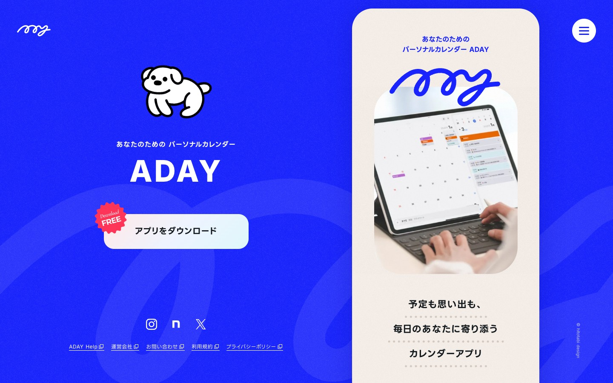
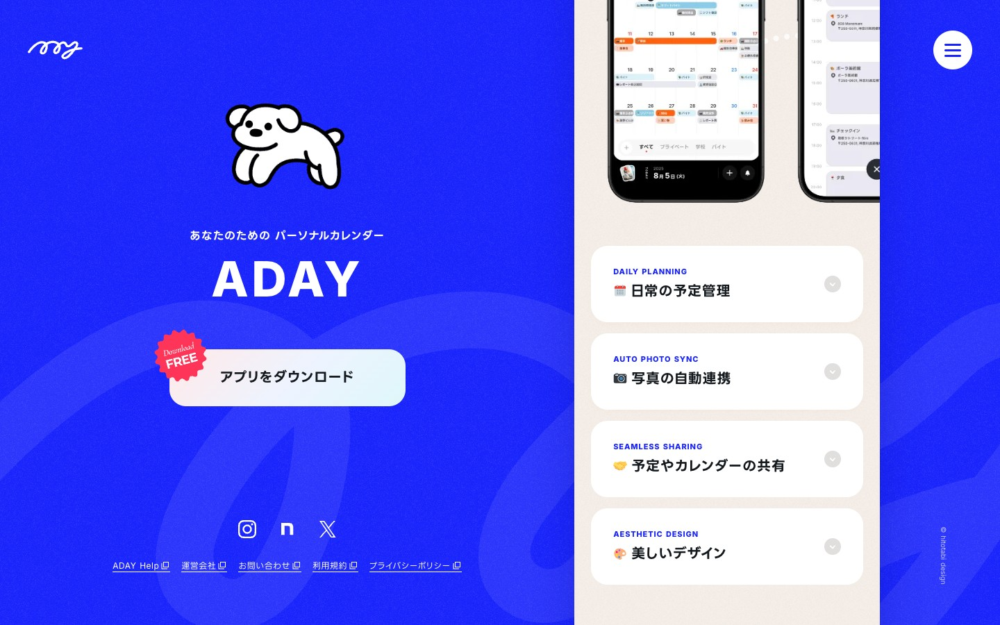
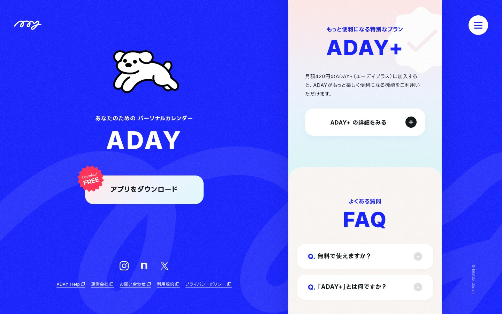
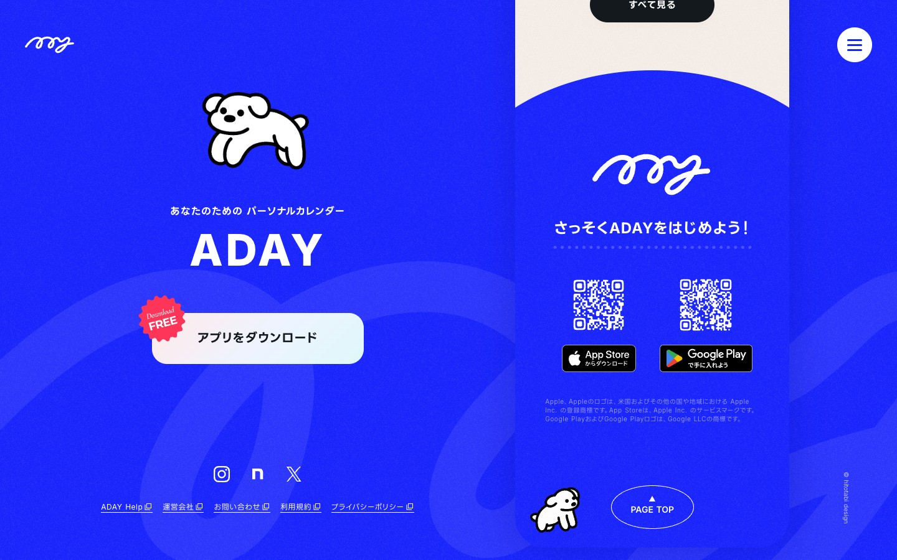

# ADAY（エーデイ） - デザイン分析

**URL:** https://1-365.me/  
**分析日:** 2026-06-27

## スクリーンショット

## サービス・コンテンツ概要
ADAYは「あなたのためのパーソナルカレンダー」アプリ。カレンダーと写真を自動連携し、予定と思い出をひとつにまとめられるシンプルなカレンダーアプリ（iOS/Android対応）。基本機能は無料で広告なし。月額420円のプレミアムプラン「ADAY+」あり。

**主な機能:**
- DAILY PLANNING：日常の予定管理
- AUTO PHOTO SYNC：写真の自動連携（端末写真と予定をカレンダーに自動表示）
- SEAMLESS SHARING：予定やカレンダーの共有（家族・恋人・グループ対応）
- AESTHETIC DESIGN：広告なしの美しいデザイン

## ターゲットユーザー
- カレンダーアプリに写真やライフログも一緒に残したい人
- 家族・恋人・グループで予定共有したい人
- シンプルで美しいUIを好む人（20〜40代女性中心と推定）
- iOS/Androidユーザー（両対応）

## カラーパレット（CSS実測値）
| 用途 | 色（CSS値） | 近似HEX |
|------|------------|---------|
| メイン背景（左パネル） | `rgb(24, 35, 255)` | #1823FF（ビビッドブルー） |
| 右パネル背景 | `rgb(246, 239, 233)` | #F6EFE9（アイボリー/ベージュ） |
| 白テキスト・白ボタン | `rgb(255, 255, 255)` | #FFFFFF |
| ダークテキスト | `rgb(51, 51, 51)` | #333333 |
| ブルーアクセント（テキスト内） | `rgb(24, 35, 255)` | #1823FF |
| ナビゲーション文字 | `rgb(20, 25, 29)` | #14191D |

## タイポグラフィ
- **ロゴ/アクセントフォント:** 手書きスクリプト体（SVGロゴ） / ビビッドブルー
- **見出しフォント:** Inter, Lineseedjp Otf Bd / h1: 16px Bold（サブタイトル的扱い）
- **ブランド見出し:** "ADAY" は特大ウェイト（視覚的に極太・大文字）/ 白色
- **英語ラベル:** "DAILY PLANNING"など英語小見出しはブルー字・小さめ
- **本文フォント:** Hiragino Kaku Gothic ProN / 16px
- **特徴:** 英語と日本語の組み合わせ、英語は大文字・スモールキャップ系、日本語はゴシック体

## セクション構成（上から順）
1. **ヒーロー（Hero）** - 左：青背景+犬イラスト+ADAY+CTAボタン（固定）、右：アプリUI + "予定も思い出も/毎日のあなたに寄り添うカレンダーアプリ" + AppStore/Google Playボタン
2. **ストーリー（思い出紹介）** - 「仕事が大変だった」「家族旅行が楽しかった」- ライフスタイル写真 + 共感コピー
3. **ABOUTセクション** - アプリ概要説明
4. **4つの主要機能** - DAILY PLANNING / AUTO PHOTO SYNC / SEAMLESS SHARING / AESTHETIC DESIGN（アコーディオン形式）
5. **HOW TO USE（使いかた事例）** - 3つのユースケース（思い出を振り返る/パートナーと/サークル）
6. **インタビュー記事誘導**
7. **ADAY+（プレミアムプラン）**
8. **FAQ（よくある質問）** - 6問のアコーディオン
9. **最新情報（NEWS）** - リリースノート等
10. **CTA（さっそくADAYをはじめよう！）** - QRコード＋App Store/Google Playボタン

## ヒーローセクション詳細
- **レイアウト:** 左右2分割（スプリットレイアウト）。左側（約45%）が固定の青背景パネル、右側（約55%）がスクロールするコンテンツエリア
- **キャッチコピー:** 「あなたのための パーソナルカレンダー」（サブ）＋「ADAY」（メイン）＋「予定も思い出も、毎日のあなたに寄り添うカレンダーアプリ」
- **ビジュアル要素:** 左パネルに手描き白犬イラスト（走るポーズ）、右パネルにアプリスクリーンショット（iPad/iPhone）、手書きスクリプトロゴ
- **CTA:** 「アプリをダウンロード」ボタン（白・大型・pill型 borderRadius: 128px）＋「Download FREE」赤スタンプバッジ
- **背景:** ビビッドブルー（#1823FF）に薄い波紋模様のテクスチャー、四隅にドット柄

## CTAデザイン
- **形状:** 大型ピル型ボタン（borderRadius: 128px）、白背景・ダーク文字
- **色:** 白背景 `rgb(255,255,255)`、テキスト `rgb(51,51,51)`
- **パターン:** ボタン左上に赤い円形スタンプ「Download FREE」（斜め配置）
- **AppStore/GooglePlay:** 右パネル下部にダークな公式バッジ（横並び）
- **ページ下部:** QRコード付きのダウンロード誘導エリア

## ナビゲーション
- 左上：手書きスクリプトのADAYロゴ（白色SVG）
- 右上：ハンバーガーメニュー（白丸背景・ダークアイコン）
- フッター（左パネル下部）：Instagram、note、X（Twitter）アイコン + 「ADAY Help / 運営会社 / お問い合わせ / 利用規約 / プライバシーポリシー」リンク
- ページは1ページ完結のランディングページ構成

## アイコン・イラスト・ビジュアルスタイル
- **キャラクター:** 白い犬のイラスト（線画スタイル）- 走るポーズと立ちポーズの2パターン。余白・遊びを体現するマスコット
- **ロゴ:** 手書き風スクリプトの日本語のような形（実際はアルファベット/サイン的デザイン）
- **写真:** アプリ使用シーンのリアル写真（iPad使用中、スマホ手持ち、カフェでの食事等）
- **UIスクリーンショット:** カレンダーアプリのUIをモックアップ（iPhone/iPad）で表示
- **装飾:** ドットパターン、波紋テクスチャー（背景に微細に）

## トンマナ・世界観
- **雰囲気キーワード:** フレッシュ・ポップ・フレンドリー・おしゃれ・日常
- **コピートーン:** 柔らかく寄り添う語り口。「あなたのための」「毎日のあなたに寄り添う」「思い出をすぐに振り返る」
- **特徴的な表現:** 英語キャプション（DAILY PLANNING等）と日本語の組み合わせ、英語は大文字でデザイン的な役割

## 特徴的なデザイン要素・テクニック
1. **固定左パネル + スクロール右パネル** — 左側のブランドエリア（ロゴ・キャラ・CTA・SNSリンク）が画面に固定され、右側のコンテンツがスクロールする独特なUI。左はポータル的役割を果たす
2. **ビビッドブルー + アイボリーのコントラスト** — 彩度の高いブルーと柔らかいアイボリーが明確なゾーニングを作り、画面を見やすく2分割する
3. **手書きロゴとキャラクターの温かみ** — アプリ系LPでは珍しい手描き要素で「親しみ」と「温かさ」を演出
4. **「Download FREE」赤スタンプ** — 無料訴求をスタンプ/バッジ型UIで表現。視線誘導とCTA強調を同時に達成
5. **ページ全体がアプリのデモ体験** — スクロールごとに右パネルの写真やUI画面が切り替わり、まるでアプリを操作しているような体験を提供
6. **波形背景テクスチャー** — ブルー背景に薄い波模様を重ねることで単調さを回避しつつ、騒がしくならない洗練されたデザイン
7. **アコーディオンFAQ** — Q.プレフィックスをブルーで強調、回答はスペースを圧縮して情報量を調整

## Lapsellへの応用メモ
- **2ペインレイアウト応用:** 左固定パネル（Lapsellブランド情報・CTAボタン・価格訴求）＋右スクロール（練習風景動画・配信イメージ・ステップ説明）のレイアウトが有効。ミュージシャン向けの世界観を左パネルで完結させる
- **ビビッドな単色背景:** アイドル/インディーズの「推し」文化とマッチする鮮やかな色（例：Lapsellならライブ感のある紫・赤・白等）を大胆に使う
- **手書き要素:** ロゴや装飾に手書き/アナログ感を加えると「アイドル・ライブ・ファン文化」との親和性が上がる
- **「FREE・0円・5%」スタンプ型UI:** ADAYの「Download FREE」スタンプのように、「初期費用0円」「手数料5%〜」「最短3分」などをスタンプ/バッジUIで強調できる
- **犬キャラ的マスコット:** Lapsellのサービスキャラクター（アイドルマスコット・音符キャラ等）を配置してブランドの個性を出す
- **スクロール連動型デモ:** 右パネルで「出品→ファン購入→DAW+カメラ録画→配信」の3ステップをスクロールに合わせてビジュアル展開できる
