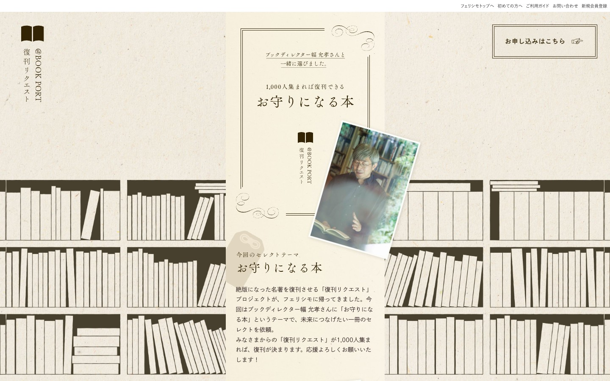
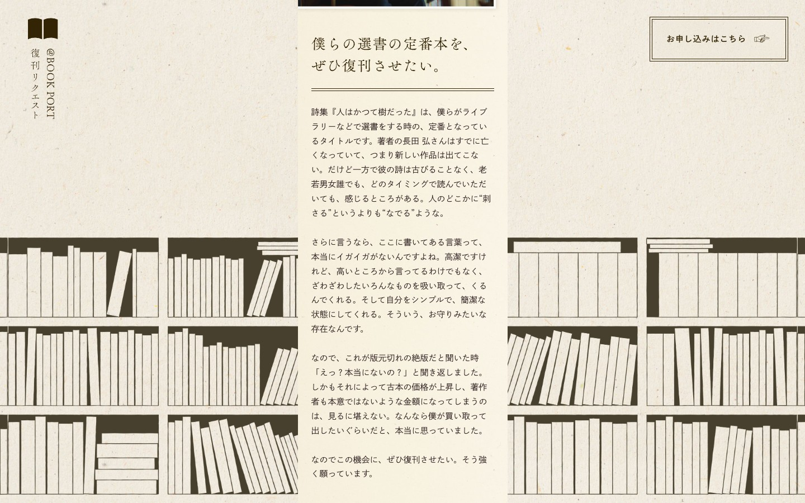
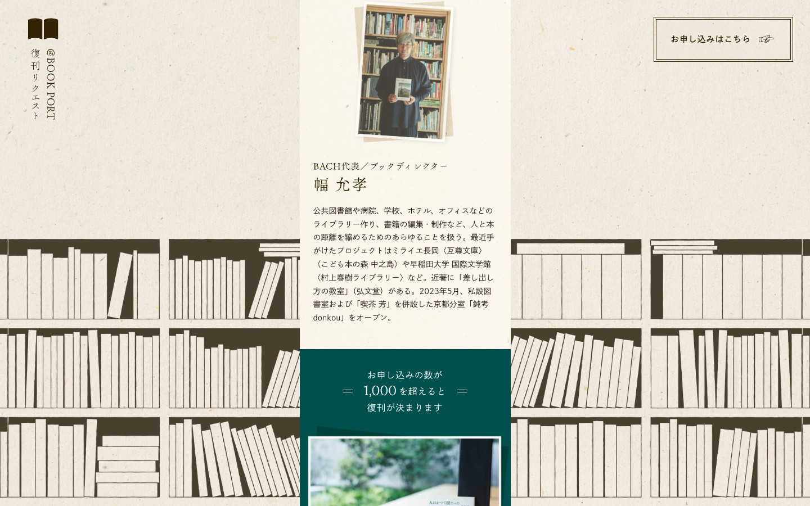
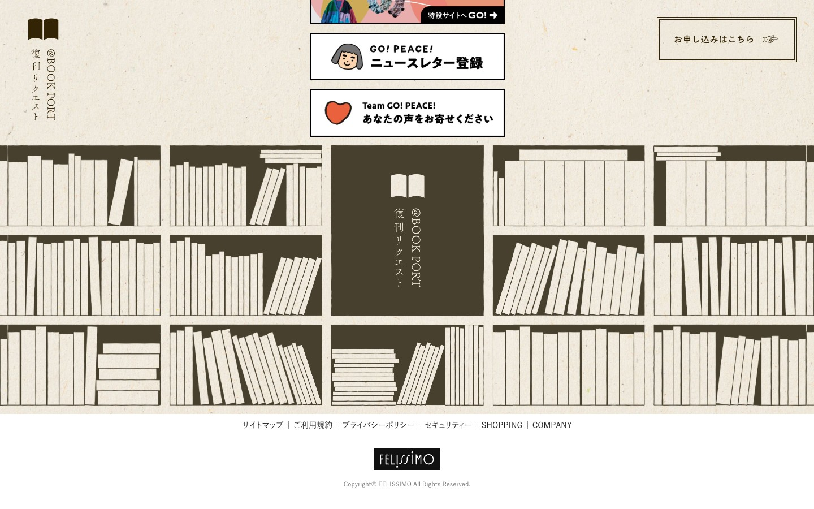

# フェリシモ 復刊リクエスト「お守りになる本」 - デザイン分析

**URL:** https://www.felissimo.co.jp/gopeace/fukkan/
**分析日:** 2026-06-27
**閲覧方法:** 既存スクリーンショット（hero/middle/features/bottom.jpg）＋ WebFetchで本文取得

## スクリーンショット

## サービス・コンテンツ概要

フェリシモの「復刊リクエスト」プロジェクトLP。絶版になった名著を、**1,000人のリクエストが集まれば復刊できる**という閾値型クラウドファンディング。今回はブックディレクター 幅允孝氏が「お守りになる本」というテーマで一冊（詩集『人はかつて樹だった』）をセレクト。価格¥1,980。モノを安く売るのではなく、**「本を未来につなぐ／一冊と人の関係」という文化的な物語**を売る。

## ターゲットユーザー

- 文学・詩・読書を愛する成熟した層
- フェリシモ会員、丁寧な暮らし／スローライフ志向の消費者
- 「心の拠り所になる一冊」を求める内省的な読者

## カラーパレット（実測・スクショより）

| 用途 | 色 | 概算HEX |
|------|-----|---------|
| 背景ベース（紙テクスチャ） | クラフト紙・アイボリー | #EDE8DC / #E8E1D2 |
| 主役テキスト | ごく濃い墨／焦茶 | #2B2A26 |
| アクセント（罫線/見出し帯） | ダークオリーブ／深緑 | #2E3A30 / #3B4A3C |
| 本文テキスト | 暖かいダークグレー | #4A463E |
| 装飾（本棚イラスト） | 墨色のシルエット | #3A382F |

**特徴:** 彩度を極端に抑えた**ナチュラル・アナログ配色**。クラフト紙の地に墨と深緑のみ。色で語らず、余白・テクスチャ・書体で語る。

## タイポグラフィ

- **主役は明朝体（セリフ和文）**。見出し「お守りになる本」は大きな明朝で、静謐で格調高い印象。
- 縦書き要素（@BOOK PORT／復刊リクエスト のラベルを左端に縦組み）。
- 英字も細いセリフ／クラシックな組み。
- 行間・字間ゆったり。**読書そのものの体験を誌面で再現**。

## セクション構成（上から順）

1. **ナビ（最小限）** - フェリシモトップ/初めての方/ご利用ガイド/お問い合わせ/新規会員登録。右に「お申し込みはこちら」枠
2. **ヒーロー（KV）** - 左端に縦組みラベル「@BOOK PORT 復刊リクエスト」。中央に明朝の大見出し「1,000人集まれば復刊できる／お守りになる本」。選者 幅允孝氏の写真（ポラロイド風に傾けて配置）。背景は紙テクスチャ＋本棚イラスト
3. **プロジェクト説明** - 「今回のセレクトテーマ：お守りになる本」。復刊リクエストの仕組みと依頼経緯
4. **閾値ビジュアル** - 「お申し込みの数が 1,000 を超えると 復刊が決まります」（深緑の帯）
5. **書籍詳細** - タイトル・著者・価格¥1,980・締切
6. **選者インタビュー** - 幅允孝氏（BACH代表）の経歴・思想を長文で（人物の信頼）
7. **@BOOK PORT 紹介** - プロジェクトの背景・歴史
8. **シェア／フッター** - 関連キャンペーンバナー

## ヒーローセクション詳細

- **レイアウト:** 中央寄せの縦長コラム。左端に縦組みラベル、中央に明朝大見出し、その下に傾けた人物写真（紙焼き写真風）
- **コピー:** 「ブックディレクター幅允孝さんと一緒に選びました。」「1,000人集まれば復刊できる」「お守りになる本」
- **ビジュアル:** 一面の**本棚イラスト（墨シルエット）**＋クラフト紙テクスチャ。装飾の唐草罫。本のアイコン（開いた本のミニピクト）
- **トーン:** 静か・知的・敬意。煽らない
- **CTA:** 「お申し込みはこちら」枠（控えめ・上品）

## CTAデザイン

- **形状:** 細い線で囲った長方形枠（ボタンらしさを抑制）。手紙のような佇まい
- **文言:** 「お申し込みはこちら」のみ。緊急性・煽りなし
- **配置:** ヘッダー右・本文末。常時1種類。**静かな招待**

## アイコン・イラスト・ビジュアルスタイル

- **本棚イラスト:** ページ全体の背景に墨色の本棚シルエットを敷く。世界観の核
- **開いた本のミニピクト:** ラベル横に小さく。線画ベース
- **唐草・飾り罫:** クラシックな装飾罫で誌面を上品に区切る
- **人物写真:** ポラロイド／紙焼き写真を傾けて貼った**スクラップブック表現**
- 全体に**紙・印刷・古書**のアナログ質感

## トンマナ・世界観

- **雰囲気キーワード:** 静謐、知的、上品、ノスタルジー、文学、丁寧な暮らし、敬意、アナログ、お守り
- **コピートーン:** 内省的で親密。商業的な緊急性より**情緒的共鳴**。「そばに自然がある生活」「未来につなげたい一冊」
- **核となる物語:** 「**消えゆくものを、みんなの意思で未来へ残す**」。一冊の本を「お守り」＝心の拠り所として捉える

## 特徴的なデザイン要素・テクニック

1. **クラフト紙テクスチャ＋墨＋深緑**の極小彩度パレットで「古書・印刷物」を再現
2. **明朝体の大見出し**＋ゆったり行間で、読書体験そのものを誌面化
3. **閾値型クラファン**（1,000人で復刊）という参加の物語＝「あなたの一票で残せる」
4. **縦組みラベル**でエディトリアル（雑誌）的な格を出す
5. **本棚イラストの全面背景**で一目で世界観を伝える
6. **選者インタビューの長文**で「人の見識」を信頼の核にする
7. **煽らないCTA**（手紙のような枠）で品位を保つ

## Lapsellへの応用メモ

このサイトの世界観をLapsell LPに転写する場合、**「静かな保存／アーカイブ／お守り」**の軸で、騒がしくない**文学的・情緒的**なLPにする。Lapsellの「将来価値」「証明として残る」「世界に1つを所有する」という価値とこの世界観は極めて相性が良い。

**コンセプト転写:**
- 復刊＝「消えゆくものを未来へ残す」 → Lapsell＝「**消えていく練習の時間を、未来へ残す**」。下積みの一瞬を「お守り」として所有
- 閾値型（1,000人で復刊） → Lapsellの**販売枠数／応援が集まる**仕組みに転写（「○人集まれば、この練習が記録に残る」）
- 「お守りになる本」 → 「**お守りになる、世界に一つの記録**」（推しの無名時代の一点物＝心の拠り所）

**ビジュアル転写:**
- クラフト紙テクスチャ＋墨＋深緑の静謐パレット
- 明朝体の大見出し、ゆったりした余白、縦組みラベル
- 本棚イラスト → **アーカイブ棚／フィルムの並び／カセットの並び**のシルエット背景に翻案
- 線画SVGアイコン（開いた本→フィルム／所有証明／鍵 など）で再現（絵文字は使わない）
- 人物写真をポラロイド風に傾けて貼るスクラップ表現＝**推し／アーティストの一瞬**を貼る

**コピー転写:**
- 内省的・敬意あるトーン。「**いつか、宝物になる。**」「**その一瞬を、未来へ。**」
- 煽らないCTA：「**この瞬間を残す**」「**応援に加わる**」

**構造転写:**
- 選者インタビュー → **出品アーティスト本人の言葉／推し活ファンの声**を長文で（人の見識＝信頼）
- 閾値ビジュアル（深緑帯の「1,000」）→ Lapsellの「将来価値・所有・真正性」を静かに数値で示す
