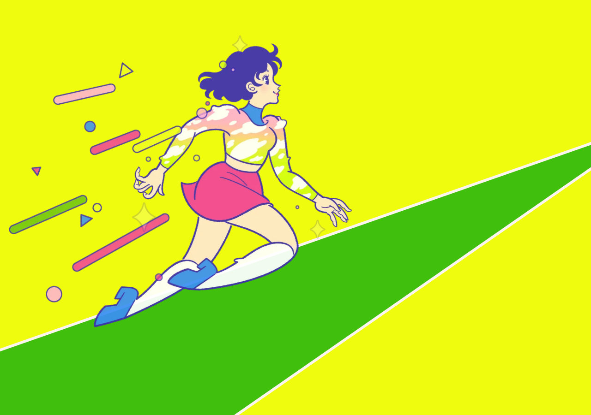
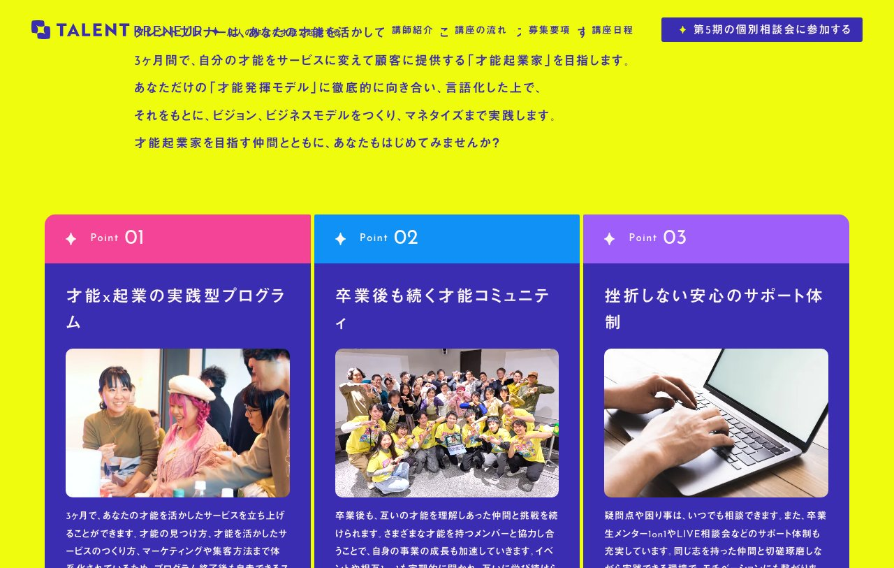
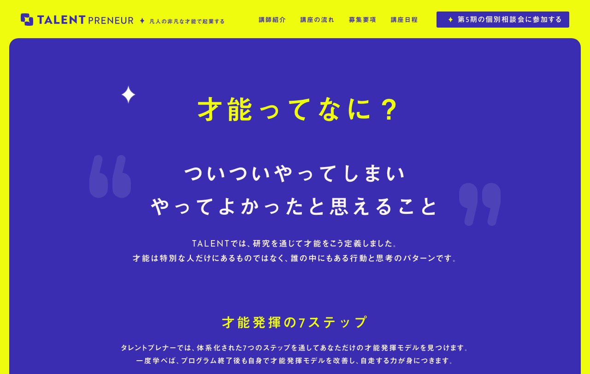
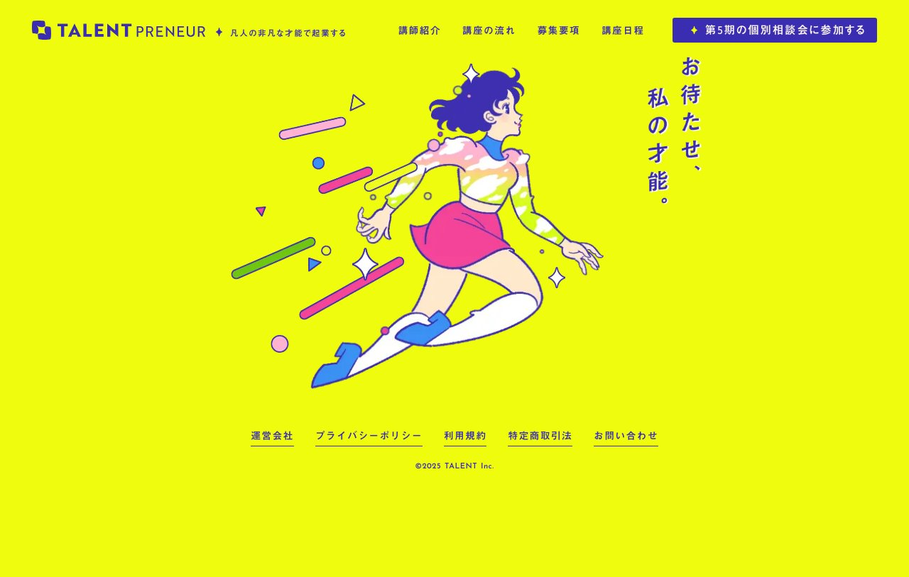

# TALENT PRENEUR - デザイン分析

**URL:** https://talent-preneur.jp/  
**分析日:** 2026-06-27

## スクリーンショット

---

## サービス・コンテンツ概要

「才能で起業するスクール」。自分の才能を活かしたサービスを3ヶ月で立ち上げる実践型オンラインスクール。才能の見つけ方（才能発揮の7ステップ）→ビジョン定義→ビジネス戦略策定→マネタイズまでを体系化。受講料396,000円（税込）。個別相談会を経て入学。定員30名。第5期（2025年11月〜2026年2月）の受講生募集。

---

## ターゲットユーザー

- 好きなことを仕事にしたいが方法がわからない会社員・フリーランス
- 自分の才能に自信がない「凡人」と感じている人
- 副業・起業・独立を目指している人（年齢・性別不問）
- 才能を活かした事業を起こしたいが、アイデアがまだない人

---

## カラーパレット（CSS実測値）

| 用途 | 色 | HEX換算 |
|------|-----|---------|
| ページ背景（メイン） | rgb(240, 252, 13) | #F0FC0D（ビビッドイエロー） |
| グリーンストライプ | rgb(118, 204, 0) | #76CC00（ライムグリーン） |
| アクセント/CTAボタン背景 | rgb(58, 45, 178) | #3A2DB2（インディゴブルー） |
| カード背景ピンク | rgb(244, 68, 152) | #F44498（マゼンタピンク） |
| カード背景パープル | rgb(157, 94, 250) | #9D5EFA（バイオレット） |
| カード背景ブルー | rgb(15, 145, 245) | #0F91F5（ライトブルー） |
| テキスト（ナビ） | rgb(51, 51, 51) | #333333 |
| ハイライト文字 | rgb(252, 245, 240) | #FCF5F0（クリームホワイト） |

---

## タイポグラフィ

- **見出しフォント:** Josefin Sans（英字） / 見出ゴMB1（日本語）
- **本文フォント:** Hiragino Kaku Gothic ProN
- **特徴:**
  - ヒーローのキャッチコピーは縦書き（writing-mode: vertical-rl）
  - 字間を大きく空けた均等割り付け（letter-spacing）
  - 日英ミックスタイポグラフィ（セクション見出しに "Teacher"、"Point" などの英語を大きく表示）

---

## セクション構成（上から順）

1. **ヘッダー/ナビ** - ロゴ + テキストリンク4つ + CTAボタン（sticky固定）
2. **ローディングアニメーション** - ビビッドイエロー全画面 → 斜めストライプ → ヒーロー登場
3. **ヒーローセクション** - アニメ女性イラスト（走る） + 縦書きキャッチコピー
4. **ニュースティッカー** - 「2025.9.8 第5期の募集を開始しました」
5. **問題提起セクション** - 「好きなことを仕事にしても、うまくいかないのはなぜか？」
6. **解決メッセージ** - 「自分の非凡な才能に気づいていないから。」
7. **サービス説明** - 「タレントプレナーとは」
8. **3つのPoint** - カード3列（ピンク・パープル・ブルー）
9. **講師紹介（Teacher）** - 大きな英字背景 + 佐野貴氏の詳細
10. **立ち上げストーリー** - 「僕の31年間を詰め込んだ、才能を生かすたのサービスを作りました。」
11. **卒業生の声** - テキストカード形式 11名掲載
12. **卒業生メンター制度** - 6名のメンタープロフィール
13. **才能定義セクション** - 「才能ってなに？」（イエロー背景に大きな引用符）
14. **才能発揮の7ステップ** - ステップ解説（STEP 1〜7）
15. **才能起業までの道のり** - TALENT→VISION→STRATEGY→MONETIZE
16. **変化事例** - Before/Afterストーリー2名
17. **コミュニティ紹介**
18. **募集要項** - 日程・参加条件・受講料・受講方法
19. **フロー説明** - 4ステップ
20. **CTA** - 「第5期の個別相談会に参加する」
21. **FAQ** - アコーディオン形式 14問
22. **フッター** - イラスト再登場 + リンク

---

## ヒーローセクション詳細

- **レイアウト:** 左寄りにアニメイラスト・右側に縦書きキャッチコピー
- **キャッチコピー:** 「お待たせ、私の才能。」（縦書き、インディゴブルー色）
- **ビジュアル要素:** 90年代アニメ風走る女性イラスト + 幾何学フローティング要素（三角・長方形・星・丸）+ 斜めグリーンストライプ
- **CTA:** ヘッダーの「第5期の個別相談会に参加する」ボタン
- **背景:** rgb(240, 252, 13) ビビッドイエロー一色

---

## CTAデザイン

- **形状:** 角丸矩形（border-radius: 4px）
- **色:** 背景 rgb(58, 45, 178)（インディゴブルー）、テキスト rgb(51, 51, 51)
- **テキスト:** 「♦ 第5期の個別相談会に参加する」（先頭にダイヤモンド記号）
- **フォントサイズ:** 16px
- **配置:** ヘッダー固定 + ページ中盤 + ページ末尾の3箇所

---

## ナビゲーション

- **固定方式:** sticky（スクロール時も上部に固定）
- **背景:** 透明（rgba(0,0,0,0)）
- **リンク:** 講師紹介 / 講座の流れ / 募集要項 / 講座日程
- **CTAボタン:** 「♦ 第5期の個別相談会に参加する」（インディゴブルー背景）
- **ロゴ:** 「S」型アイコン + "TALENT"（太字）+"PRENEUR"（細字）のコントラスト

---

## アイコン・イラスト・ビジュアルスタイル

- **メインイラスト:** 90年代アニメ調の走る女性（バブル期風）。ピンクのミニスカート・レインボーのタイツ・青い靴。カラフルで大胆な配色
- **フローティング幾何学:** 色付きの三角形・長方形・丸・星型が散りばめられている（Memphis Design風）
- **セクション見出し装飾:** 巨大な英字テキスト（"Teacher"、"tanadlin"等）を背景として薄く配置（ゴーストテキスト）
- **スパークル:** 4点星型のスパークル（✦）をアクセントとして多用
- **カードデザイン:** 3列の特徴カード（ピンク・パープル・ブルー）はフォトカードと説明テキストのコンビネーション

---

## トンマナ・世界観

- **雰囲気キーワード:** ポップ、エネルギッシュ、クリエイティブ、90年代ノスタルジア、グラフィックアート、アニメ風、非日常
- **コピートーン:** 感情に訴えるポエティックなコピー
  - 「お待たせ、私の才能。」
  - 「さあ、迎えにいこう。」
  - 「凡人の非凡な才能で起業する」
- **特徴的な表現:**
  - 自己否定からの解放（「凡人だからではなく」）
  - 縦書き日本語で詩的に表現
  - 「♦ ダイヤモンド」記号をナビやボタン全体で統一的に使用

---

## 特徴的なデザイン要素・テクニック

1. **オープニングアニメーション:** 黄色→斜めストライプ→イラスト登場という段階的ローディング演出
2. **縦書きヒーローコピー:** `writing-mode: vertical-rl` による縦書きキャッチコピー（インパクト大）
3. **Memphis Design風フローティング要素:** 色とりどりの幾何学形状が浮遊するビジュアル演出
4. **スクロールアニメーション:** テキストが1行ずつフェードインしながら現れる
5. **カードのカラーコーディング:** 3つの特徴を異なるビビッドカラーで色分け
6. **ゴーストテキスト背景:** セクション名を薄い大きな英字で背景に配置
7. **スパークルモチーフ:** ✦ 記号と星型装飾を一貫して使用
8. **フッターにキャラ再登場:** ブランドの一貫性を維持
9. **ニュースティッカー:** ヒーロー下部に横スクロールするお知らせバナー
10. **過大letter-spacing:** セクション見出しに誇張した字間でインパクト重視

---

## Lapsellへの応用メモ

**カラー応用:**
- ライブ感・才能の爆発を表現するためにビビッドカラー（蛍光系）を検討
- インディゴ（#3A2DB2）とイエローの補色コンビはコントラストが強くCTAとして機能
- 地下アイドル・インディーズに合うダーク+蛍光の組み合わせも参考に

**レイアウト応用:**
- 縦書きキャッチコピー → アーティスト向けに和のテイストで差別化可能
- 「問題提起→共感→解決策」の流れを流用：「練習は収益にならない」→「でも才能とファンの時間は確かに存在する」→「Lapsellが解決」
- ユーザー声セクション → 既存アーティストの声を同形式で掲載

**コピーライティング応用:**
- 自己否定を解消するアプローチ：「稼げないのは才能がないからではなく、練習を収益化する仕組みがないから」
- ポエティックなコピー調を採用：「お待たせ、アーティストの価値。」

**テクニック応用:**
- ローディングアニメーションでブランドカラーを印象付ける
- スパークル記号（✦）をLapsellブランドの装飾モチーフとして採用検討
