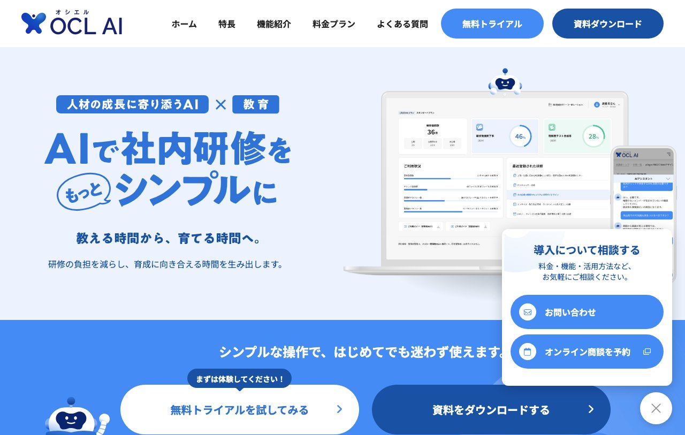
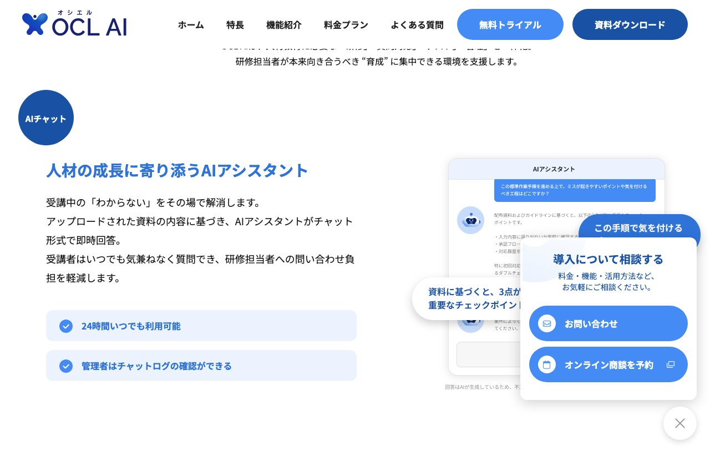
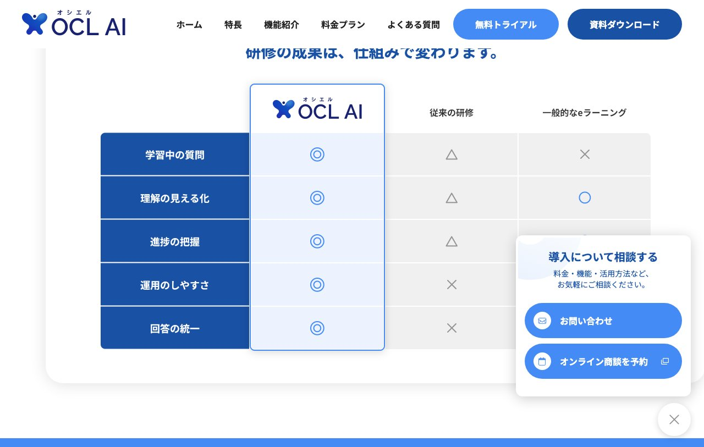
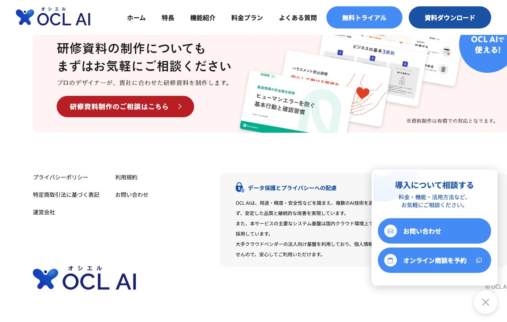

# OCL AI - デザイン分析

**URL:** https://ocl-ai.jp/  
**分析日:** 2026-06-27

## スクリーンショット

---

## サービス・コンテンツ概要

AI活用型社内研修プラットフォーム。既存の社内資料（PDF）をアップロードするだけで、AIがチャット形式の質問対応・理解度テスト自動生成・進捗管理を自動化。研修担当者の「教える」負担を削減し、「育てる」時間を生み出す。無料トライアルあり。月額29,800円〜（ライトプラン）。

---

## ターゲットユーザー

- 社内研修の担当者（HR担当・管理職）
- 新人教育や社員研修に時間とコストをかけている企業
- 研修の効果測定・進捗管理に課題を感じている組織
- 属人化したノウハウの組織共有を目指している会社

---

## カラーパレット（CSS実測値）

| 用途 | 色 | HEX換算 |
|------|-----|---------|
| 背景（ヒーロー/ライト） | rgb(236, 243, 254) | #ECF3FE（ライトブルー） |
| メインアクセント/CTAボタン | rgb(69, 139, 245) | #458BF5（ミディアムブルー） |
| ダークアクセント/サブCTA | rgb(25, 81, 165) | #1951A5（ダークブルー） |
| ホバー/グラデーション | rgb(47, 115, 217) | #2F73D9（コバルトブルー） |
| 本文テキスト | rgb(26, 26, 26) | #1A1A1A（ほぼ黒） |
| ナビ背景 | rgb(255, 255, 255) | #FFFFFF（白） |
| セクション背景 | rgb(236, 243, 254) | #ECF3FE（ライトブルー） |

---

## タイポグラフィ

- **見出しフォント:** Kosugi / Noto Sans JP / Hiragino Sans（優先順）
- **本文フォント:** Kosugi, "Noto Sans JP", "Hiragino Sans", "Hiragino Kaku Gothic ProN", Meiryo, sans-serif
- **特徴:**
  - 英語フォントは指定なし（デフォルト）
  - 見出しは太字・青系カラー（#458BF5）で統一
  - 本文は読みやすさ優先のシンプルな設定

---

## セクション構成（上から順）

1. **ヘッダー/ナビ** - ロゴ + テキストリンク5つ + 2CTAボタン（「無料トライアル」青・「資料ダウンロード」濃紺）
2. **ヒーローセクション** - キャッチコピー + ダッシュボードモックアップ + AIマスコット + 2CTA並列パネル
3. **2CTAボタンバナー** - 「無料トライアルを試してみる」（青・白丸） + 「資料をダウンロードする」（濃紺）
4. **痛点セクション** - 雲型カード3枚（「時間がない」「教えても定着しない」「属人化している」）+ ビジネスパーソンイラスト
5. **問題分析** - 「なぜ、社内教育の負担が減らないのか？」テキスト中心
6. **特長セクション** - 「OCL AIは、人材教育に必要な研修・質問対応・テスト・管理を一体化」
7. **機能詳細1: AIチャット** - 左テキスト + 右スクリーンショット（2カラム）
8. **機能詳細2: 理解度テスト** - 左スクリーンショット + 右テキスト（2カラム）
9. **機能詳細3: 進捗管理** - 左テキスト + 右ダッシュボード
10. **機能詳細4: ナレッジ** - AIが勝手に答えない仕組み
11. **導入後変化** - 4項目のBefore/After
12. **機能一覧** - INPUT→OUTPUT フロー図（管理者→受講者）
13. **管理機能一覧** - 研修管理/問い合わせ/ナレッジ/受講者/管理者/お知らせ
14. **比較テーブル** - OCL AI vs 従来の研修 vs 一般的なeラーニング（5項目×3列）
15. **料金プラン** - 無料/ライト/スタンダード/プロの4プラン
16. **導入フロー** - 3ステップ（トライアル→体験→有料移行）
17. **FAQ** - アコーディオン形式 12問
18. **2CTA再掲** - 「今すぐ無料トライアルを開始」+ 「資料をダウンロードする」
19. **研修資料制作案内** - アップセルバナー（赤CTAボタン）
20. **フッター** - リンク + データ保護説明 + ロゴ

---

## ヒーローセクション詳細

- **レイアウト:** 左側にテキスト、右側にダッシュボードモックアップ（2カラム）
- **キャッチコピー:** 「AIで社内研修をもっとシンプルに」（大きな青テキスト）
- **サブコピー:** 「教える時間から、育てる時間へ。」「研修の負担を減らし、育成に向き合える時間を生み出します。」
- **タグライン:** 「人材の成長に寄り添うAI」×「教育」（バッジ形式）
- **ビジュアル要素:** PCダッシュボードモックアップ + スマホチャット画面 + AIマスコット（青い丸顔キャラ）
- **CTA:** 右下に浮き出るパネル「導入について相談する」（お問い合わせ・オンライン商談の2つが並列）
- **背景:** ライトブルー（#ECF3FE）からホワイトのグラデーション

---

## CTAデザイン

- **パターン1 - プライマリ:** 「無料トライアル」rgb(69, 139, 245)、白テキスト、border-radius: 56px（大きな角丸）
- **パターン2 - セカンダリ:** 「資料ダウンロード」rgb(25, 81, 165)、白テキスト、border-radius: 56px
- **パターン3 - フローティング:** 「資料をダウンロードする」rgb(25, 81, 165)、border-radius: 93px
- **パターン4 - スティッキー:** 「導入について相談する」rgb(25, 81, 165)、border-radius: 40px（右下固定）
- **2CTA並列パターン:** ヒーロー右下に「お問い合わせ」「オンライン商談を予約」が縦2列で並ぶ

---

## ナビゲーション

- **固定方式:** sticky（白背景で固定）
- **背景:** 白（rgb(255, 255, 255)）
- **リンク:** ホーム / 特長 / 機能紹介 / 料金プラン / よくある質問
- **2CTAボタン:** 「無料トライアル」（青丸角） + 「資料ダウンロード」（濃紺丸角）
- **ロゴ:** 蝶（X字）アイコン + "OCL AI"（オシエルAI）

---

## アイコン・イラスト・ビジュアルスタイル

- **AIマスコット:** 丸い青いロボット顔（スマイリー風）。ヒーローとCTAフローティングに登場
- **雲型痛点カード:** 花びら型（クラウド形状）の白い大型カードに問題を記載。背景は白でライトブルーと対比
- **ビジネスパーソンイラスト:** スーツ・ジャケット姿の3人（男女混合）のフラットイラスト。汗マーク付き（困り感を表現）
- **ダッシュボードモックアップ:** 実際のアプリUIのスクリーンショットをMacbookとスマホのフレームに収めて表示
- **チェックマークアイコン:** 青いチェック丸（◎）で機能一覧を表示
- **比較テーブル:** 青い行背景に白テキストで項目名、◎△×の記号で評価を表現

---

## トンマナ・世界観

- **雰囲気キーワード:** 信頼感、プロフェッショナル、シンプル、清潔感、企業向けSaaS、テクノロジー
- **コピートーン:** 課題解決型・実用主義。「教える時間から、育てる時間へ。」「研修担当者が、『教える』ことに疲れていませんか？」
- **特徴的な表現:**
  - 読者への問いかけで共感を喚起（「疲れていませんか？」）
  - 対比表現（「教える」→「育てる」、「属人化」→「組織化」）
  - 数値/プラン名で具体性を担保（「最大50問」「29,800円/月」）

---

## 特徴的なデザイン要素・テクニック

1. **雲型痛点カード:** border-radiusと形状で「もやもや感・悩み」を視覚化した独特なカード形状
2. **2CTA並列パネル:** ヒーローの右下コーナーに「お問い合わせ」「オンライン商談」の2択CTAを重ねる
3. **スティッキーCTA:** 右下に「導入について相談する」ボタンが常時フローティング表示
4. **フローティングUIモックアップ:** PCとスマホのデバイスフレームに実UIを収めてプロダクト感を演出
5. **比較テーブル:** 自社優位性を◎△×で明快に可視化する定番SaaS手法
6. **INPUT→OUTPUTフロー図:** 「管理者がPDFをアップ→AIが自動処理→受講者が学習」の流れを矢印で表現
7. **段階的フェードインアニメーション:** スクロールに応じてコンテンツが出現（intersection observer活用）
8. **AIマスコット一貫使用:** ヘッダーロゴ・ヒーロー・フローティングCTAに同じキャラを配置
9. **料金プランのハイライト:** 4プランのうち「おすすめ」バッジ付きの「プロプラン」を視覚的に強調
10. **フッターのアップセルバナー:** 「研修資料の制作についても」という関連サービスへの誘導

---

## Lapsellへの応用メモ

**カラー応用:**
- ライトブルー（#ECF3FE）+ ミディアムブルー（#458BF5）の組み合わせはLapsellのカラーに近い可能性がある
- 信頼感・プロフェッショナル感を出したい場合はこの配色が参考になる
- 2CTAパターン（青+濃紺）はLapsellの「今すぐ出品」+「詳細を見る」などに応用可能

**レイアウト応用:**
- 雲型カードの「痛点カード」手法 → Lapsell版：「練習時間が無収益だった」「ライブ以外で収益を得る機会がない」「ファンとのつながりが希薄だった」という3つの痛点を雲型で表示
- 2CTA並列パネル → Lapsellでは「まず出品してみる」「詳しく話を聞く」の2択を同様のスタイルで配置
- 比較テーブル → 「従来のグッズ/音源販売」vs「Lapsell練習時間販売」の比較表

**コピーライティング応用:**
- 問いかけ型コピー：「練習時間から収益を得られていますか？」
- 対比表現：「練習するだけの時間」→「ファンに価値を届ける時間」
- 「教える→育てる」のような動詞の対比：「消費する→生産する」「無収益→収益化」

**テクニック応用:**
- スティッキーフローティングCTA → Lapsellでも「今すぐ無料で出品する」を右下に常時表示
- プロダクトのスクリーンショットをデバイスフレームに収めて信頼感を演出
- AIマスコット的なキャラクターをLapsellのブランドアイコンとして設定検討
